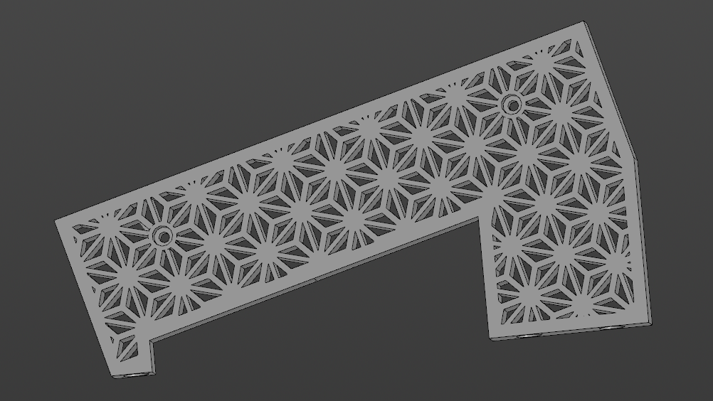

# Octatrack MK2 3D Printed Stands with Kumiko Pattern

This project contains 3D printable stand designs for the **Elektron Octatrack MK2**, featuring a traditional **Kumiko woodwork pattern** as a decorative and structural element.

## 📸 Gallery

## ✨ Features

- **Custom-designed Kumiko pattern** front panels  
- Ergonomic elevation and viewing angle for the Octatrack MK2  
- Designed to be 3D printed at home  
- Modular and sturdy build  
- Aesthetic meets function: blends traditional Japanese craft with modern design  

## 🛠️ Tools Used

- **[OpenSCAD](https://openscad.org/)** – used for parametric design and pattern generation  
- **[KOMPAS-3D](https://kompas.ru/)** – used for refining geometry and making detailed adjustments

## 🧩 Kumiko Pattern

The Kumiko pattern used in this project was generated using the open-source project:  
🔗 [https://github.com/froqstar/kumikoPatterns](https://github.com/froqstar/kumikoPatterns)

Huge thanks to [froqstar](https://github.com/froqstar) for making these beautiful patterns accessible.

## 🖨️ Printing Instructions

- **Material:** PLA, PETG, or similar  
- **Layer Height:** 0.2mm or finer for visible detail. I was using 0.12 Hight Quality Bambulab preset.
- **Supports:** May be needed for some overhangs depending on orientation  
- **Infill:** 15–30% (depending on desired strength)  
- **Bed Size:** Ensure your printer's bed can accommodate the full dimensions

## 🔖 License

This project is shared under the **MIT License**.  